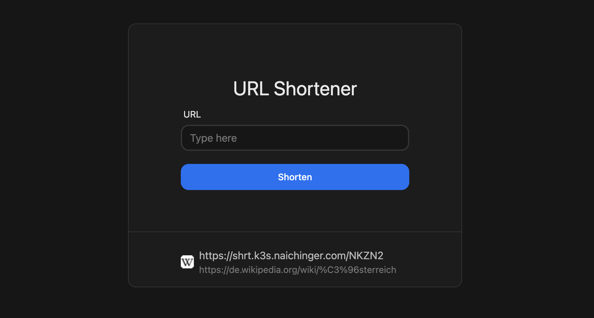
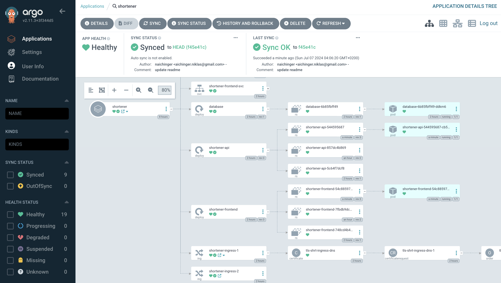

# URL Link Shortener

## Live DEMO: https://shrt.k3s.naichinger.com

This is demo app for continuous deployment of a helm app with argo cd. It uses quarkus as a backend which stores links in a postgres database.

## Workflow

When a contributor commits on the main branch a github action gets triggered. This github actions creates new images for the backend and frontend and tags them with the first eight characters of the commit hash. After both images are pushed to the registry another workflow get triggered which updates the version of the application in the helm chart `values.yml`. There also exists another trigger for when a tag gets pushed which will also update values file.

## ArgoCD

